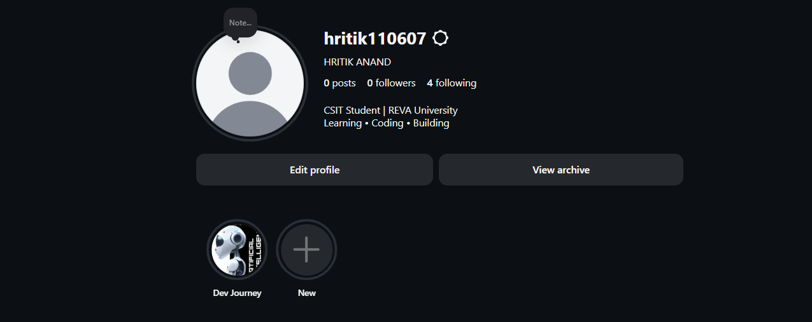
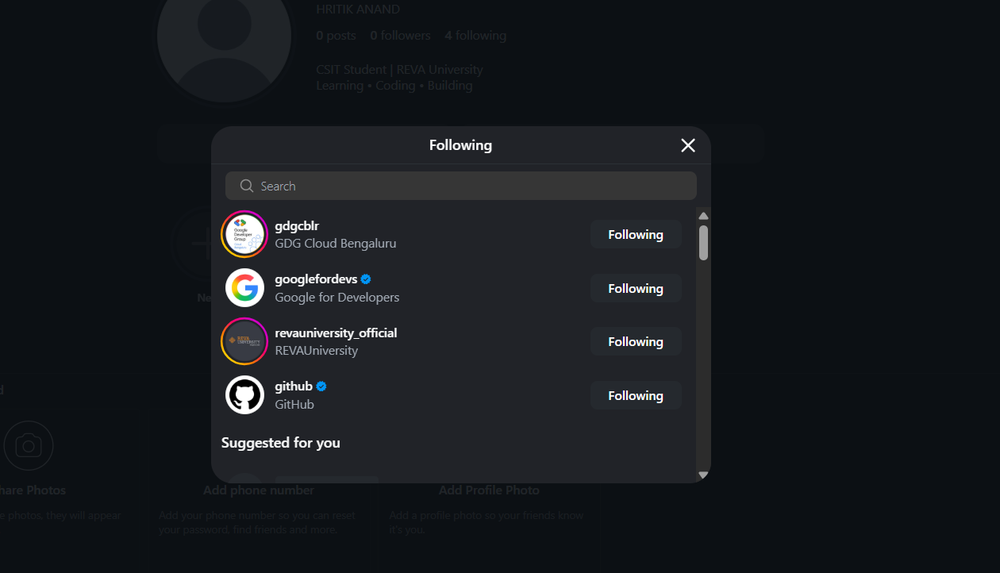

# Activity-11-Instagram-Branding
# Activity 11 – Instagram Branding & Coding Platforms

## Student Details

**Name:** Hritik Anand  
**Branch:** CSIT  
**University:** REVA University

## Objective

To use Instagram as a visual platform to document my coding and development journey.

## Activities Completed

### 1. Instagram Branding
Created and published a coding-themed Instagram Story using Canva.

### 2. Dev Journey Highlight
Created a "Dev Journey" highlight and saved my coding Story.

### 3. Tech Community Accounts
Followed three technology/developer-community accounts related to coding and development.

## Evidence

### Instagram Story

### Tech Accounts Followed

### Dev Journey Highlight

## Tools Used

- Instagram
- Canva
- GitHub

## Learning Outcome

This activity helped me build a professional online presence and document my coding journey using visual content.
